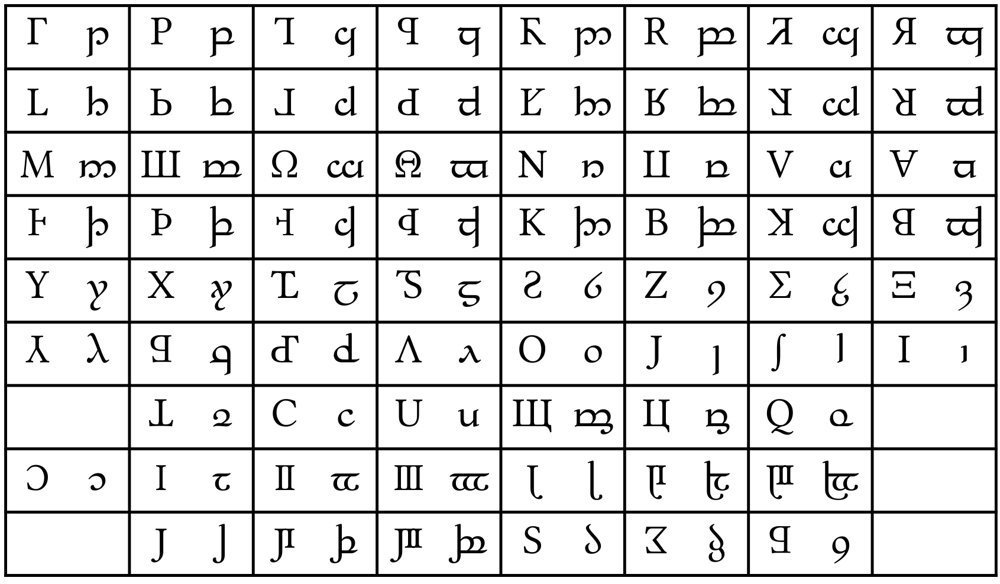

# Tengwar Gondolin

Tengwar font with majuscule letters of my own design (mostly affine transformations of Latin, Greek and Cyrillic capitals), based on glyphs from [_Libertinus._](https://github.com/alerque/libertinus)  
It is intended to be typed without tehtar, but they are included.

Glyphs, compared to [_Alcarin_](https://github.com/Tosche/Alcarin-Tengwar):

